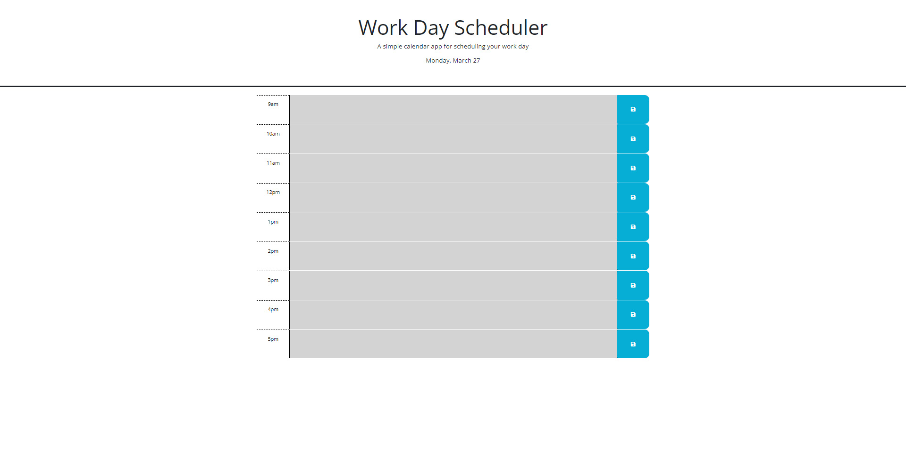

# busy-manager

## Description
This project was made to help organize a users schedule by setting a color to the hours that either are in the past, present, or future. The user is able to save text within the schedule. For this project I used BootStrap and JQuery.

## Screenshot

## Installation

N/A

## Credits

N/A

## License

N/A